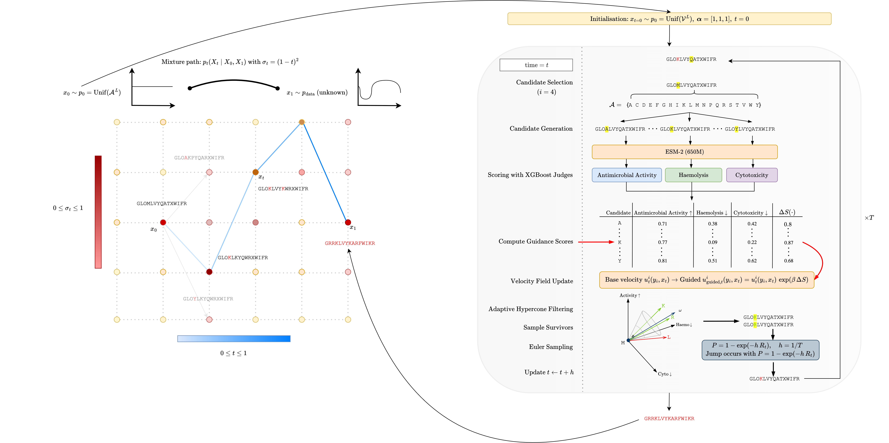

# AMP-DFM: Discrete Flow Matching for Multi-Property Antimicrobial Peptides

This repository contains the core functions and code from my MSc thesis. This project involved designing a generative antimicrobial peptide model, AMP-DFM, to overcome core limitations in generative AMP models - notably, the increased toxicity risk that emerges from solely optimising the antimicrobial potency of generated peptides.



A generative discrete flow matching model was used to create realistic and diverse peptides. The denoising process was then modified using trained classifiers for haemolysis, cytotoxicity and antimicrobial activity. Peptides were steered towards Pareto-optimal trade-offs across these properties with the goal of producing candidate sequences more likely to succeed in clinical settings.

Other parts of the analysis such as peptide structure prediction, comparison with other models (generative + classifiers) and data collation were performed in a separate repository. This repository contains only the main analysis and results.

## Outline

- **Data Preprocessing**: Cluster sequences with MMseqs2, generate ESM-2 embeddings, and prepare tokenised datasets
- **XGBoost Classifiers**: Train classifiers on ESM-2 embeddings for antimicrobial activity, haemolysis, and cytotoxicity prediction
- **Unconditional Training**: Train a discrete flow matching model on antimicrobial peptide sequences
- **Conditional Fine-tuning**: Fine-tune the model with 4-bit conditioning vectors for specific antimicrobial activities (generic, E. coli, P. aeruginosa, S. aureus)
- **Unguided Sampling**: Generate peptides from the trained model without guidance
- **Multi-Objective Guided Sampling**: Generate peptides optimised for antimicrobial activity while minimising haemolysis and cytotoxicity

## Setup

Create and activate the conda environment from the provided environment file:

```bash
git clone https://github.com/kjayres/AMP-DFM
cd amp_dfm
conda env create -f documentation/amp-dfm.yml
conda activate amp-dfm
pip install torch==2.4.0 torchvision==0.19.0 torchaudio==2.4.0 triton==3.0.0 --index-url https://download.pytorch.org/whl/cu124
```

## Data Preprocessing

Prepare the datasets before training models. Run these scripts in order:

### Sequence Clustering

Cluster sequences using MMseqs2 and assign train/val/test splits:

```bash
python scripts/data_preprocessing/mmseqs_cluster.py
python scripts/data_preprocessing/assign_cluster_split.py
```

### Generate Embeddings

Generate ESM-2 embeddings for classifier training:

```bash
python scripts/data_preprocessing/generate_embeddings.py
```

### Prepare Tokenised Datasets

Prepare unconditional dataset:

```bash
python scripts/data_preprocessing/prepare_ampdfm_uncond_dataset.py
```

Prepare conditional dataset with 4-bit conditioning vectors:

```bash
python scripts/data_preprocessing/prepare_ampdfm_cond_dataset.py
```

## Classifiers

Train XGBoost classifiers on ESM-2 embeddings for peptide property prediction. These classifiers are used to evaluate generated peptides.

```bash
# Antimicrobial activity classifier (generic)
python scripts/classifiers/train_classifiers.py \
    --config configs/classifiers/antimicrobial_activity_generic_xgboost.yaml

# Haemolysis classifier
python scripts/classifiers/train_classifiers.py \
    --config configs/classifiers/haemolysis_xgboost.yaml

# Cytotoxicity classifier
python scripts/classifiers/train_classifiers.py \
    --config configs/classifiers/cytotoxicity_xgboost.yaml
```

Organism-specific antimicrobial activity classifiers can also be trained:

```bash
# E. coli
python scripts/classifiers/train_classifiers.py \
    --config configs/classifiers/antimicrobial_activity_ecoli_xgboost.yaml

# P. aeruginosa
python scripts/classifiers/train_classifiers.py \
    --config configs/classifiers/antimicrobial_activity_paeruginosa_xgboost.yaml

# S. aureus
python scripts/classifiers/train_classifiers.py \
    --config configs/classifiers/antimicrobial_activity_saureus_xgboost.yaml
```

Classifiers are saved in `checkpoints/classifiers/`.

## Training

### Unconditional Training

Train an unconditional AMP-DFM model on antimicrobial peptide sequences:

```bash
python scripts/dfm/ampdfm_unconditional.py --config configs/flow_matching/ampdfm_unconditional.yaml
```

The unconditional model learns the distribution of antimicrobial peptides without conditioning on specific properties. Training uses a CNN architecture with discrete flow matching and mixture path generalised KL loss.

### Conditional Fine-tuning

Fine-tune the unconditional model with 4-bit conditioning vectors for targeted antimicrobial activity:

```bash
python scripts/dfm/ampdfm_conditional_finetune.py \
    --config configs/flow_matching/ampdfm_conditional_finetune.yaml \
    --device cuda \
    --amp_only
```

The conditional model extends the architecture with conditioning on four antimicrobial activity types: generic, E. coli, P. aeruginosa, and S. aureus. Though I didn't find this to be anymore useful than simply using a species-specific classifier trained on a subset of the main antimicrobial activity dataset.

## Sampling

### Unguided Sampling

Generate peptides from the trained model without classifier guidance:

```bash
python scripts/dfm/ampdfm_uncond_sample.py --config configs/flow_matching/ampdfm_uncond_sample.yaml
```

This generates peptides and, for the sake of comparison, evaluates them using the trained classifiers for antimicrobial activity, haemolysis, and cytotoxicity.

### Multi-Objective Guided Sampling

Generate peptides optimised for multiple objectives using classifier-guided sampling:

```bash
python scripts/mog/ampdfm_mog.py --config configs/mog/ampdfm_mog_generic.yaml
```

This uses the classifiers to guide the generative process toward the design of peptides with high antimicrobial activity and low haemolysis and cytotoxicity. The guidance process can be customised through various parameters. Here are a few:

**Key parameters in the config file:**
- `amp_variant`: Target organism (generic, ecoli, paeruginosa, saureus)
- `importance`: Weighting for each objective [antimicrobial, haemolysis, cytotoxicity]
- `homopolymer_gamma`: Penalty strength for homopolymer sequences
- `n_samples` and `n_batches`: Number of peptides to generate

**Additional command-line options:**
- `--guidance-weight`: Strength of classifier guidance during sampling
- `--temperature`: Sampling temperature (controls diversity)
- `--cone-angle`: Angular constraint for maintaining sequence coherence during guidance

## Outputs

Generated peptides are saved in two formats:
- **FASTA**: Sequences in FASTA format (`outputs/peptides/*/samples.fa`)
- **CSV**: Sequences with classifier scores (`outputs/peptides/*/samples_scores.csv`)

## Citation

The code for this repo and the generative model is largely based on the work of Chen et al. and Lipman et al. The design of the antimicrobial activity classifiers is based on the work of Soares et al. and Szymczak et al. The design of the haemolysis classifier is based on the work of Capecchi et al.

If this code is of any use, you may be interested in the relevant papers:

```bibtex
@misc{chen2025multiobjectiveguideddiscreteflowmatching,
      title={Multi-Objective-Guided Discrete Flow Matching for Controllable Biological Sequence Design}, 
      author={Tong Chen and Yinuo Zhang and Sophia Tang and Pranam Chatterjee},
      year={2025},
      eprint={2505.07086},
      archivePrefix={arXiv},
      primaryClass={cs.LG},
      url={https://arxiv.org/abs/2505.07086}
}

@misc{lipman2024flowmatchingguidecode,
      title={Flow Matching Guide and Code}, 
      author={Yaron Lipman and Marton Havasi and Peter Holderrieth and Neta Shaul and Matt Le and Brian Karrer and Ricky T. Q. Chen and David Lopez-Paz and Heli Ben-Hamu and Itai Gat},
      year={2024},
      eprint={2412.06264},
      archivePrefix={arXiv},
      primaryClass={cs.LG},
      url={https://arxiv.org/abs/2412.06264}
}

@misc{soares2025targetedampgenerationcontrolled,
      title={Targeted AMP generation through controlled diffusion with efficient embeddings}, 
      author={Diogo Soares and Leon Hetzel and Paulina Szymczak and Fabian Theis and Stephan Günnemann and Ewa Szczurek},
      year={2025},
      eprint={2504.17247},
      archivePrefix={arXiv},
      primaryClass={cs.LG},
      url={https://arxiv.org/abs/2504.17247}
}

@article{szymczak2023discovering,
      title={Discovering highly potent antimicrobial peptides with deep generative model HydrAMP},
      author={Szymczak, Paulina and Możejko, Marcin and Grzegorzek, Tomasz and Bauer, Radosław and Neubauer, Damian and Michalski, Mateusz and Sroka, Jacek and Setny, Piotr and Kamysz, Wojciech and Szczurek, Ewa},
      journal={Nature Communications},
      volume={14},
      number={1},
      pages={1453},
      year={2023},
      publisher={Nature Publishing Group},
      doi={10.1038/s41467-023-36994-z},
      url={https://doi.org/10.1038/s41467-023-36994-z}
}

@article{capecchi2021machine,
      title={Machine learning designs non-hemolytic antimicrobial peptides},
      author={Capecchi, Alice and Cai, Xingguang and Personne, Hippolyte and Köhler, Thilo and van Delden, Christian and Reymond, Jean-Louis},
      journal={Chemical Science},
      year={2021},
      volume={12},
      number={26},
      pages={9221--9232},
      publisher={The Royal Society of Chemistry},
      doi={10.1039/D1SC01713F},
      url={http://dx.doi.org/10.1039/D1SC01713F}
}
```
